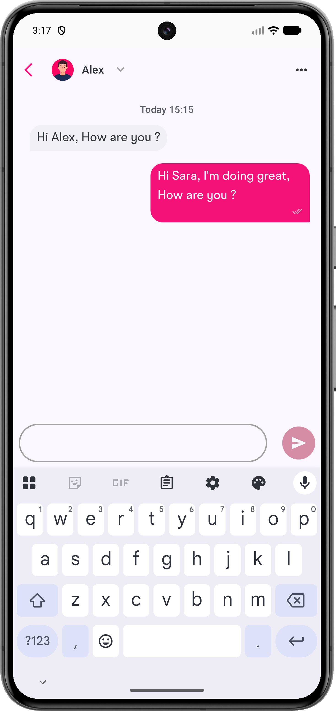

# Chat Demo Android App
### Screen Shots
<table>
  <tr>
    <td>Home Screen</td>
     <td>Filter Page</td>
  </tr>
  <tr>
    <td></td>
    <td></td>
  </tr>
 </table>

### Tech stack & Open-source libraries
- SDK level 32 to 36 API
- Written in [Kotlin](https://kotlinlang.org/)
- [MVVM design pattern]("https://www.geeksforgeeks.org/android/mvvm-model-view-viewmodel-architecture-pattern-in-android/") with [Clean architecture principles]("https://blog.cleancoder.com/uncle-bob/2012/08/13/the-clean-architecture.html").
- Dependency injection with [Hilt](https://developer.android.com/training/dependency-injection/hilt-android)
- Safe API call with [Retrofit](https://github.com/square/retrofit) & [Coroutines](https://kotlinlang.org/docs/coroutines-overview.html)
- Caching API response with [OkHttpClient](https://square.github.io/okhttp/4.x/okhttp/okhttp3/-ok-http-client/) 
- Observing data changes and updating the UI state with [StateFlow](https://kotlinlang.org/api/kotlinx.coroutines/kotlinx-coroutines-core/kotlinx.coroutines.flow/-state-flow/)
- [Jetpack Compose](https://developer.android.com/jetpack/compose) in one of the module with [Material 3 UI](https://m3.material.io/develop/android/jetpack-compose)
- [Room Database](https://developer.android.com/training/data-storage/room)
- [Jetpack](https://developer.android.com/jetpack) libraries
  - [Navigation](https://developer.android.com/guide/navigation) - Handling navigation between destinations within the app
  - [Lifecycle](https://developer.android.com/topic/libraries/architecture/lifecycle) - Handling lifecycles with lifecycle-aware component
  - [ViewModel](https://developer.android.com/topic/libraries/architecture/viewmodel) - Storing and managing UI-related data in a lifecycle-conscious way
- [Kotlin Coroutines](https://kotlinlang.org/docs/coroutines-overview.html)
- [Kotlin Flow](https://kotlinlang.org/docs/flow.html)
- [OkHttp](https://github.com/square/okhttp) - Implementing interceptors
- [Certificate Transparency]("https://github.com/appmattus/certificatetransparency") : For API Security 

### Testing

- [Truth](https://truth.dev/) (Fluent assertions for Java and Android)
- [Junit](https://junit.org/junit4/) (Unit tests)
- [Turbine](https://github.com/cashapp/turbine) (A small testing library for kotlinx.coroutines Flow)
- [MockK](https://mockk.io/) (mocking library for Kotlin)

## Demo App Structure

# Project Structure

This project follows **Clean Architecture** principles, ensuring a clear **Separation of Concerns** and improved **Testability**.  
It is organized into **three main layers**:

- **Data**
- **Domain**
- **Presentation**

Additionally, multiple test configurations are provided to ensure quality and maintainability.

---

## Test Setup

- **`androidTest/`** → Instrumentation tests using **Espresso** and **Hilt Test** libraries.
- **`debug/`** → Contains `HiltTestActivity`, used as a host for UI tests.
- **`test-utils/`** → Shared utilities module for both unit and instrumentation tests (e.g., common data, custom Hilt Test Runner).
- **`test/`** → Unit tests with **MockK**, and **Hilt**.

---

## Layers

### 1. Data Layer
Responsible for managing application data, whether from the **network** or **local database**.  
Contains four key packages:

- **`local/`** → Room database components for local persistence.
- **`mapper/`** → Functions to map data between sources and domain models.
- **`remote/`** → Retrofit components for network requests.
- **`repositoryImpl/`** → Implementations of repository interfaces defined in the domain layer.

---

### 2. Domain Layer
The **core business logic layer** that connects Data ↔ Presentation.  
It is **independent** of other layers, ensuring maintainability and testability.

Packages include:

- **`model/`** → Data classes representing entities exposed to the Presentation layer.
- **`repository/`** → Abstract repository interfaces that decouple Domain from Data.
- **`usecase/`** → Business logic use cases, reusable across multiple ViewModels.

---

### 3. Presentation Layer
Handles **UI rendering** and interaction with the user.

- **`ui/`** → Contains Activities, Fragments, and their corresponding ViewModels.

---

## Project Requirements

- Java 21+
- Android Studio Otter | 2025.2.1

## Try the App
Download & install the <a href="apk/app-debug.apk">APK file<a/> to try the app.