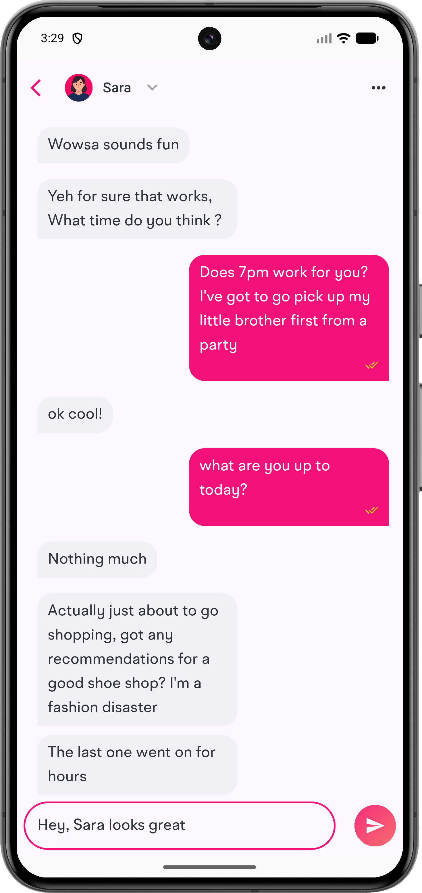
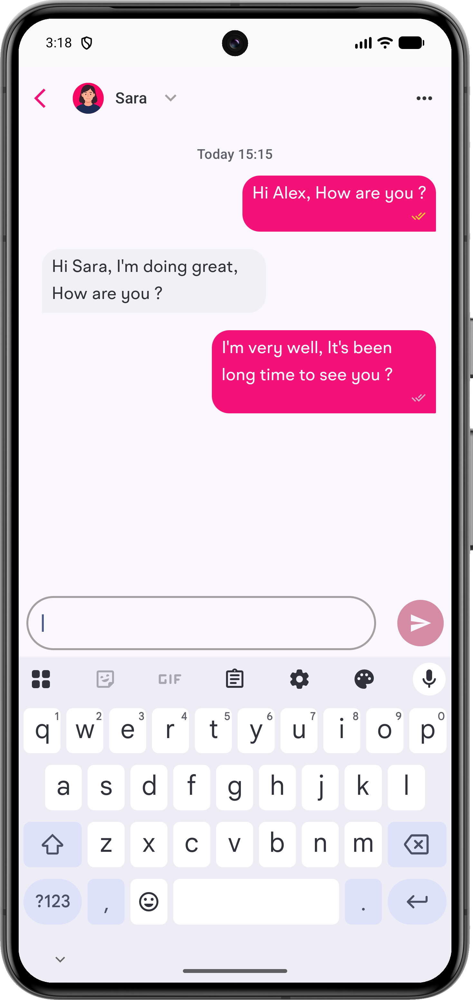
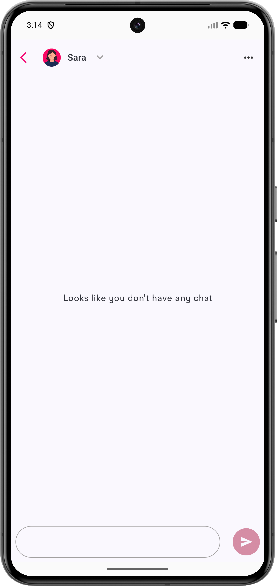
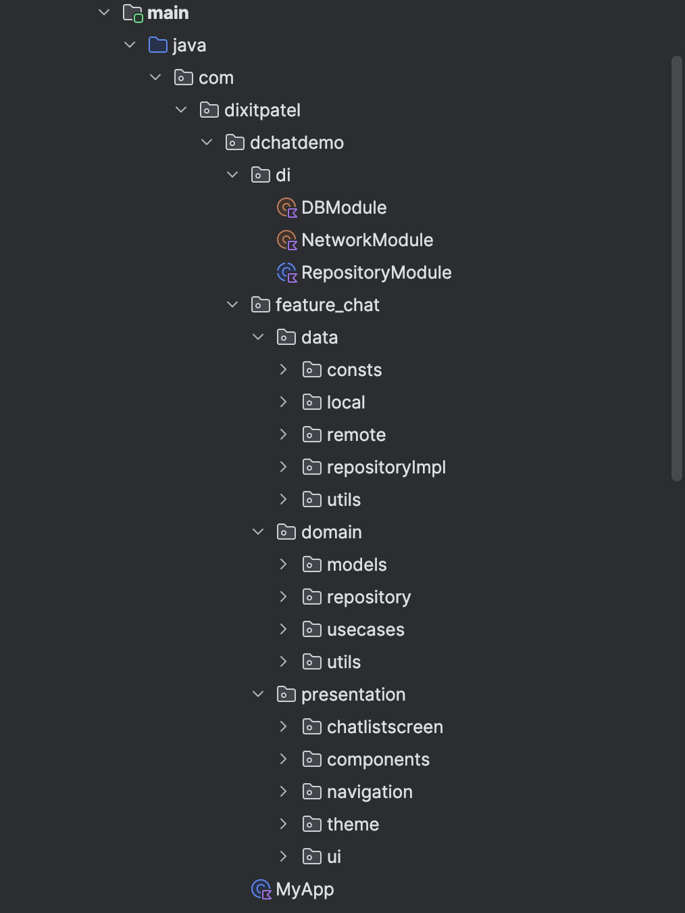

# Chat Demo Android App
### Screen Shots
<table>
  <tr>
    <td>Two-way Chat</td>
     <td>Two-way Chat</td>
     <td>Empty Chat</td>
  </tr>
  <tr>
    <td></td>
    <td></td>
    <td></td>
  </tr>
 </table>

## 🎥 Watch Full Demo

- [![Watch on YouTube]](https://youtu.be/G-mfTCNlsQ4?si=4ogzxK8oYoOoTFPu)

- [▶️ Watch Demo (MP4)](screen-shots/10.mp4)

## Try the App
Download & install the <a href="apk/app-debug.apk">APK file<a/> to try the app.

### Tech stack & Open-source libraries
- SDK level 32 to 36 API
- Written in [Kotlin](https://kotlinlang.org/)
- [MVVM design pattern]("https://www.geeksforgeeks.org/android/mvvm-model-view-viewmodel-architecture-pattern-in-android/") with [Clean architecture principles]("https://blog.cleancoder.com/uncle-bob/2012/08/13/the-clean-architecture.html").
- Dependency injection with [Hilt](https://developer.android.com/training/dependency-injection/hilt-android)
- Safe API call with [Retrofit](https://github.com/square/retrofit) & [Coroutines](https://kotlinlang.org/docs/coroutines-overview.html)
- Caching API response with [OkHttpClient](https://square.github.io/okhttp/4.x/okhttp/okhttp3/-ok-http-client/) 
- Observing data changes and updating the UI state with [StateFlow](https://kotlinlang.org/api/kotlinx.coroutines/kotlinx-coroutines-core/kotlinx.coroutines.flow/-state-flow/)
- [Jetpack Compose](https://developer.android.com/jetpack/compose) in one of the module with [Material 3 UI](https://m3.material.io/develop/android/jetpack-compose)
- [Room Database](https://developer.android.com/training/data-storage/room)
- [Jetpack](https://developer.android.com/jetpack) libraries
  - [Navigation](https://developer.android.com/guide/navigation) - Handling navigation between destinations within the app
  - [Lifecycle](https://developer.android.com/topic/libraries/architecture/lifecycle) - Handling lifecycles with lifecycle-aware component
  - [ViewModel](https://developer.android.com/topic/libraries/architecture/viewmodel) - Storing and managing UI-related data in a lifecycle-conscious way
- [Kotlin Coroutines](https://kotlinlang.org/docs/coroutines-overview.html)
- [Kotlin Flow](https://kotlinlang.org/docs/flow.html)
- [OkHttp](https://github.com/square/okhttp) - Implementing interceptors
- [Certificate Transparency]("https://github.com/appmattus/certificatetransparency") : For API Security 

### Testing

- [Truth](https://truth.dev/) (Fluent assertions for Java and Android)
- [Junit](https://junit.org/junit4/) (Unit tests)
- [Turbine](https://github.com/cashapp/turbine) (A small testing library for kotlinx.coroutines Flow)
- [MockK](https://mockk.io/) (mocking library for Kotlin)

## Demo App Structure

## 🎯 Key Implementation and Decisions

### 1. Clean Architecture Implementation

**`Decision:`**
Implement Clean Architecture with strict separation between layers.

**`Rationale:`**
-	Ensures testability, scalability, and maintainability.
-	Enables mocking and independent testing of each layer.
-	Aligns with Android Architecture Guidelines and SOLID principles.

**`Implementation:`**
-	Domain Layer — Pure Kotlin business logic, no Android dependencies.
-	Data Layer — Room database, DAOs, and repository implementations.
-	Presentation Layer — Jetpack Compose UI + ViewModel-driven state.
-	Dependency Inversion — Interfaces define behavior; concrete implementations are injected via Hilt.

### 2. UI State Management

**`Decision:`**
Separate UI state (ChatUIState) from the ViewModel, exposing it as a StateFlow.

**`Rationale:`**
-	Improves UI testability and enables stateless Composables.
-	Simplifies recomposition and reduces side effects.
-	Allows unit testing of UI logic without rendering Compose UI.

**`Implementation:`**
-	ChatListViewModel holds a single immutable `StateFlow<ChatUIState>`.
-	Composable functions observe state updates using `collectAsState()`.
-	`onMessageTextChanged()` and `onUserSelected()` trigger updates safely using `launchSafe()`.

### 3. Messages sectioning Logic

**`Decision:`**
Group messages based on sender ID and time proximity.

**`Rationale:`**
-	Reduces visual clutter and improves readability.
-	Mimics established UX patterns from modern messaging apps.
-	Prevents redundant timestamp headers and groups contextually related messages.

**`Implementation:`**
-	Consecutive messages from the same sender within 20 seconds are grouped.
-	Messages separated by ≥1 hour show a timestamp header.
-	Implemented via `groupMessagesBySenderAndTime()` in the domain layer — ensuring pure, testable logic.

### 4. Read Status Implementation

**`Decision:`**
Use an isRead boolean flag on each message, with corresponding UI indicators.

**`Rationale:`**
-	Lightweight and effective approach for message read tracking.
-	Mirrors familiar UX from messaging apps (✓ for sent, ✓✓ for read).
-	Easy to extend if backend synchronization is added later.

**`Visual Indicators:`**
-	✓✓ (Gray color): Sent
-	✓✓ (Yellow color): Read

**`Implementation:`**
-	`markMessagesAsRead(currentUserId)` in DAO updates unread messages.
-	ViewModel automatically triggers read updates on user switch.

### 5. Database Design

**`Decision:`**
Use Room Database with `LocalDateTime` for message timestamps.

**`Rationale:`**
-	Room simplifies data persistence with compile-time query validation.
-	`LocalDateTime` provides robust time operations and formatting.
-	Custom `TypeConverters` ensure proper serialization/deserialization.

**`Implementation:`**
-	`MessagesDao` and `UsersDao` define reactive CRUD operations returning Flows.
-	Tested using in-memory Room database for integration coverage.
-	Verified that insert, update, and `markMessagesAsRead()` behave correctly.

###  6. User Management

**`Decision:`**
Use two predefined local users with switchable roles.

**`Rationale:`**
-	Simplifies the demo without implementing authentication or network APIs.
-	Keeps focus on core chat functionality.
-	Demonstrates local persistence and real-time state updates.

**`Implementation:`**
-	Users defined as constants: Sara (user1) and Alex (user2).
-	Stored locally via `UserEntity` in Room.
-	Switching users triggers automatic read-status updates.

### 7. Testing Strategy

**`Decision:`**
Implement a comprehensive multi-layer testing strategy using industry-standard tools.

**`Rationale:`**
-	Guarantees each layer behaves correctly in isolation and integration.
-	Promotes confidence in refactoring, CI/CD automation, and scalability.
-	Validates both synchronous and asynchronous logic (Flows, coroutines, and state).

## Test Setup

- **`androidTest/`** → Instrumentation tests using **Espresso** and **Hilt Test** libraries.
- **`debug/`** → Contains `HiltTestActivity`, used as a host for UI tests.
- **`test-utils/`** → Shared utilities module for both unit and instrumentation tests (e.g., common data, custom Hilt Test Runner).
- **`test/`** → Unit tests with **MockK**, and **Hilt**.

---

## Project Requirements

- Java 21+
- Android Studio Otter | 2025.2.1
- AGP 8.0+

## 📋 Assumptions Made

### 🧑‍🤝‍🧑 User Management

**`Assumption`**: Only two predefined users exist in the system.

**`Justification`**:
-	Keeps the architecture simple while demonstrating user switching.
-	Focuses on core messaging functionality instead of authentication.
-	Reflects realistic chat context between two local profiles — Sara and Alex.

### 💬 Message Delivery

**`Assumption`**: Messages are delivered instantly and marked as read when the other user is active.

**`Justification`**:
-	Simulates real-time delivery behavior without introducing networking or server logic.
-	Simplifies testing and ensures deterministic results in UI and repository tests.
-	Keeps user experience consistent and predictable for demo purposes.

### 💾 Data Persistence

**`Assumption`**: Uses local Room database only — no remote backend or synchronization.

**`Justification`**:
-	Emphasizes offline-first design and clean data flow architecture.
-	Demonstrates repository abstraction and Flow-based reactive persistence.
-	Reduces complexity, focusing the project on clean architecture, not networking.

### ✉️ Message Types

**`Assumption`**: Only text messages are supported.

**`Justification`**:
-	Maintains a focused scope to demonstrate message persistence, grouping, and display.
-	Avoids complications like media storage or compression logic.
-	Ensures testing remains lightweight and business-rule–centric.

### ⏰ Time Formatting

**`Assumption`**: Uses a standardized relative time format —
“Today”, “Yesterday”, “Day of Week”, or “Full Date”.

**`Justification`**:
-	Aligns with modern messaging app conventions (e.g., WhatsApp, Telegram).
-	Enhances readability and user familiarity.
-	Keeps logic centralized in LocalDateTime extension functions — making it easily testable.

### 🎨 UI Design

**`Assumption`**: Based on Muzz brand colors and Material 3 Design principles.

**`Justification`**:
-	Creates a professional and modern appearance.
-	Ensures accessibility with contrast-friendly colors and adaptive theming.
-	Separates state-driven UI logic for better composability and testability.

### ⚙️ Performance

**`Assumption`**: Designed for moderate message volumes (hundreds, not thousands).

**`Justification`**:
-	Ideal for small-scale, demo, or personal messaging apps.
-	Ensures smooth scrolling and lightweight Room database operations.
-	Focuses on architectural clarity over large-scale optimization.

### 🧪 Testing Context

**`Assumption`**: All tests run on JVM or instrumented devices using mock or in-memory data.

**`Justification`**:
-	Eliminates external dependencies for repeatable, isolated test results.
-	Guarantees full coverage across domain, data, and presentation layers.
-	Aligns with the Clean Architecture goal of testability and modularity.

## ⚠️ Limitations & Known Issues

This demo project focuses on **Clean Architecture**, **local data flow**, and **UI/UX patterns** — not on full-scale production chat functionality.  
Below are the current known limitations and potential future improvements:

| 🧩 Area | 🚫 Limitation                                                 | 🚀 Future Improvement |
|:--------|:--------------------------------------------------------------|:----------------------|
| **Networking** | No network layer – all messages are stored locally using Room | Add WebSocket or REST API for real-time message sync and cloud persistence |
| **Conversations** | Single hardcoded conversation (e.g., “Sara”, "Alex")          | Implement conversation list with multiple user threads |
| **Media Support** | Only text messages supported                                  | Add media picker for images, audio, and file attachments |
| **Animations** | Basic send/receive transitions only                           | Introduce smoother message bubble animations and micro-interactions |
| **Read Receipts** | Missing visual checkmarks for sent/read states                | Add `isRead` flag with ✓ (sent) and ✓✓ (read) indicators |
| **Typing Indicators** | Not implemented                                               | Add “User is typing…” indicators using Flow or socket events |
| **Error Handling** | Limited — errors logged but not displayed to user             | Add user-friendly error messages and retry actions |
| **Pagination** | Loads all messages at once                                    | Add pagination or lazy loading for large message histories |
| **User Switching** | Two predefined users only (Sara & Alex)                       | Extend to dynamic user accounts with authentication flow |

---

